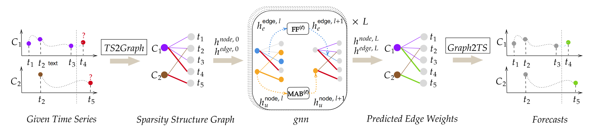
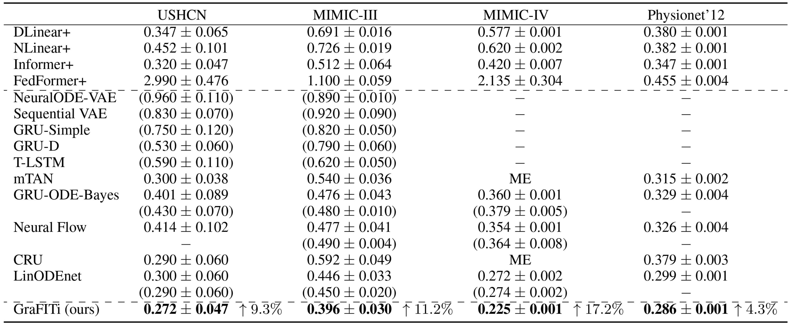
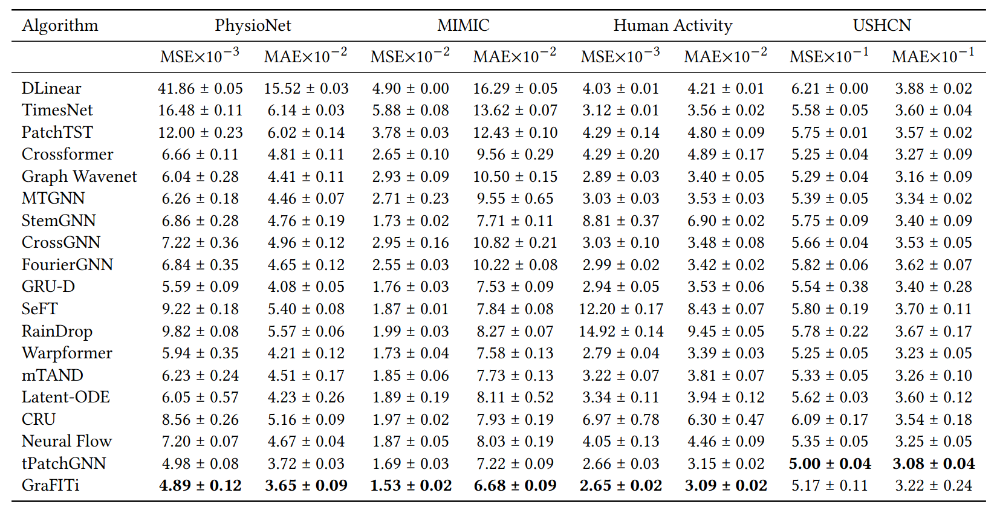

# GraFITi

This is the source code for the paper [GraFITi: Graphs for Forecasting of Irregularly sampled Time Series](https://ojs.aaai.org/index.php/AAAI/article/view/29560) published in AAAI 2024



# Requirements
python                    3.8.11

Pytorch                   1.9.0

sklearn                   0.0

numpy                     1.19.3

pandas                    1.5

# Training and Evaluation

We provided the script to run all the datasets with hyperparameters for fold ``0``. With these scripts, one can reproduce the results.

```
train_grafiti.py --epochs 200 --learn-rate 0.001 --batch-size 128 --attn-head 4 --latent-dim 64 --nlayers 4 --dataset ushcn --fold 0 -ct 36 -ft 0
train_grafiti.py --epochs 200 --learn-rate 0.001 --batch-size 128 --attn-head 4 --latent-dim 64 --nlayers 2 --dataset physionet2012 --fold 0 -ct 36 -ft 0
train_grafiti.py --epochs 200 --learn-rate 0.001 --batch-size 64 --attn-head 4 --latent-dim 128 --nlayers 1 --dataset mimiciii --fold 0 -ct 36 -ft 0
train_grafiti.py --epochs 200 --learn-rate 0.001 --batch-size 128 --attn-head 1 --latent-dim 128 --nlayers 1 --dataset mimiciv --fold 0 -ct 36 -ft 0
```



MIMIC-IV and MIMIC-III require permissions to download the data. Once, the datasets are downloaded, you can add them to the folder .tsdm/rawdata/ and use the TSDM package to extract the folds. We use TSDM package provided by Scholz .et .al from [https://openreview.net/forum?id=a-bD9-0ycs0]


# Edit: Extension for more experiments
Recently more and more IMTS forecasting works have been using the evaluation protocol as proposed by Zhang et al in "Irregular Multivariate Time Series Forecasting: A Transformable Patching Graph Neural Networks Approach" (ICML 2024). Hence, we updated our code so future works can be compared to GraFITi easily. We apply the same hyperparameter search in our original paper and yield these results:



To reproduce these results you can run:

```
python zhang_experiments.py --nlayers 4 --attn-head 2 --latent-dim 64 --dataset activity --history 3000
python zhang_experiments.py --nlayers 4 --attn-head 2 --latent-dim 64 --dataset mimic --history 24
python zhang_experiments.py --nlayers 4 --attn-head 2 --latent-dim 64 --dataset physionet --history 24
python zhang_experiments.py --nlayers 2 --attn-head 2 --latent-dim 128 --dataset ushcn --history 24
```
